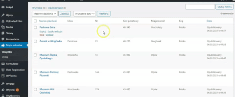

## Projekt

Wtyczka dla wordpressa. Dodawanie adresów do mapy z pinezkami poprzez własny typ wpisów (CPT );

## Demo View

# CPT
Tabele z kolumnami (nazwa placówki, ulica, numer, kod pocztowy, miejscowość, kraj, data publikacji);

# Metaboxes
Pola do wprowadzenia adresu  (placówki, ulica, numer, kod pocztowy, miejscowość, kraj)

# Shortcut

[address_map]

# WP-json Router
https://{nazwa domeny}/wp-json/address-map/v1/search

Każda pinezka zawiera

1. Zdjęcie miejsca -> Obrazek wyróżniający
2. Tytuł -> Tytuł wpisów
3. Opis do 20 znaków-> Kontent 
4. Link -> link do pojedyńczego wpisu
5. Adres -> adress z metabox

Wtyczka wersja bardzo podstawowa, dla własnych celów praktycznych. 
